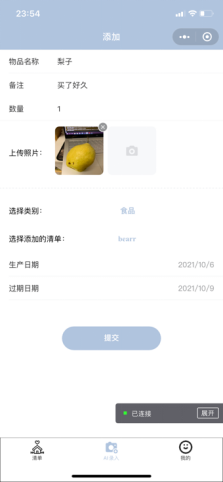

# Tipsapp-Wxapp
## 项目介绍
我们发现生活中的物品都有生命周期，到期后就会被淘汰，我们因为记不住它的使用期限而导致浪费。例如，大量囤积的日用品在保质期内未使用完毕就扔掉；或者忘记某样物品在家里存储的位置，导致重复购买；又或者家庭成员由于不知道其他成员已经购买物品导致再次购买。我们希望解决以上的问题，让每一位用户体会到“数字生活”带来的便利、快捷和人性化。  

## 技术栈：
WXML+WXSS+JavaScript+Node.js+NoSQL(云存储技术)  

  

## 运行方式
进入微信开发者工具即可

## 1.登录界面
通过获取用户的同意登录权限实现此功能，获取用户信息。用户可通过微信号登录，在页面产生点击事件后才可调用登录函数，每次请求都会弹出授权窗口，用户同意后返回 userInfo，此时将获得用户的头像，昵称，唯一标识符：cloudid等信息。
  

  
在登录成功后将会出现以下界面。  

## 2.AI添加界面
添加页面有以下信息填写，在AI录入模式时，在图片选择确定后，物品名称将会自动填写。用户可以根据自己需要填写备注，数量，类别，以及生产日期，以及希望系统的提醒日期，
选择想要添加的清单，各个清单可与不同的人共享，用户可以在主页面看到所有自己的物品。  

用户可以拍照或在相册内选择图片进行上传。  

  

相册内选取图片或实时拍照选取图片  

上传后，程序可自动AI识别物品的信息进行填写，同时也可以进行手动录入以及修改。
## 3.主页面
系统支持通过物品名字进行搜索。在分类菜单，点击后会出现 化妆品，食品，药品三大预设好的分类板块，用户点击具体类别后，会只显示该类别物品。
	用单元格的形式显示用户添加的所有物品及信息，每个单元格内显示物品的图片、名称、标签、具体生产日期，并计算出剩余过期天数。点击每个单元格可以进入修改界面（与添加界面布局相同，但显示出正在编辑的物品信息方便修改），主界面下有一个“加号按钮”，点击后跳转到添加页面。  

  

  

## 4.提醒功能
在物品到期后，系统主页面上方将会出现提醒“您有物品过期了哦！”，以供用户查看。  

## 5.共享清单功能
在共享清单页面，用户可以通过创建分组的按钮创建属于自己的共享清单，或通过输入其他人的清单名字以及对方的id进行清单添加。在清单列表页面，将会显示清单的名字，
以及创建人的微信昵称，以供辨别。  

  

邀请者可以通过告知清单号和自己的id，让加入者在其客户端输入自己的id以及清单号完成加入，在加入成功后，清单列表会实时更新清单。
点击进入共享页面以后可以显示具体清单的内容：  

  

  
用户也可以自己创建属于自己的清单。  

## 6.“我的”界面
在导航栏的第三个部分为我的界面，点击共享清单可以进入3.2.5的界面。  
  
在Q&A中，针对食品没有明确保质期现象，我们整理出了一份各类食品存放日期参考表提供给用户，用户可以在添加物品时打开它，对食品保存时长进行参考。  

  
版本信息记录了我们开发的过程。  
  
提供意见反馈界面可以像项目开发者进行反馈  

